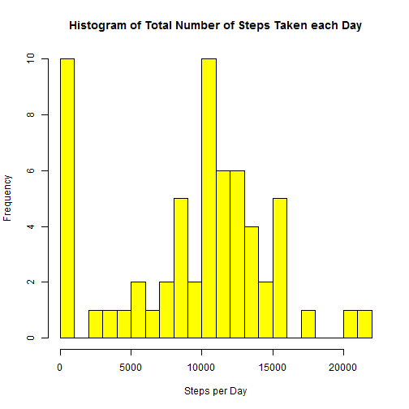
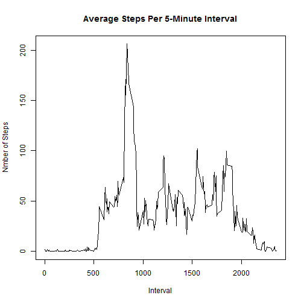
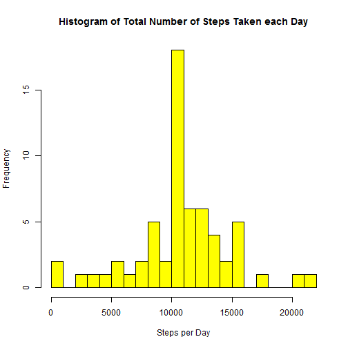
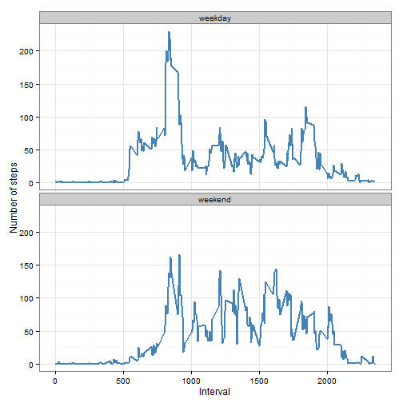

## Loading and preprocessing the data

```r
datafile <- ".\\activity.csv"

data <- read.csv(datafile, header=TRUE, na.strings="NA", 
                      ,colClasses = c("numeric","character","numeric"), stringsAsFactors=FALSE)
data$date <- as.Date(data$date, format="%Y-%m-%d")
```


## What is mean total number of steps taken per day?

1. Histogram to display Total Number of Steps taken each Day

```r
data.date <- aggregate(data[1],by=data[2],FUN=sum,na.rm=TRUE)
hist(data.date$steps,
        breaks=20,col = "yellow",
        main = "Histogram of Total Number of Steps Taken each Day",
        xlab = "Steps per Day")
```

 

2. Mean Total Number of Steps taken each Day (ignoring missing values)

```r
round(mean(data.date$steps),0)
```

```
## [1] 9354
```

3. Median Total Number of Steps taken each Day (ignoring missing values)

```r
round(median(data.date$steps),0)
```

```
## [1] 10395
```
## What is the average daily activity pattern?

1.Time series plot of the 5-minute interval (x-axis) and the average number of steps taken, averaged across all days (y-axis)

```r
data.interval <- aggregate(data[1],by=data[3],FUN=mean,na.rm=TRUE)
plot(x=data.interval$interval,
     y=data.interval$steps,
     type="l",
     main="Average Steps Per 5-Minute Interval",
     xlab="Interval",
     ylab="Nmber of Steps")
```

 

2. Which 5-minute interval, on average across all the days in the dataset,contains the maximum number of steps?     

```r
data.interval$interval[which.max(data.interval$steps)]
```

```
## [1] 835
```

## Imputing missing values

1.Calculate and report the total number of missing values in the dataset

```r
sum(is.na(data))
```

```
## [1] 2304
```

2. Fill in all of the missing values in the dataset

         Strategy: Replace missing step values with the mean steps for the interval (as calculated in "data.interval")


3. Create a new dataset that is equal to the original dataset but with the missing data filled in with the Mean for the interval.

```r
suppressMessages(require(dplyr))

datatidy <- merge(data, data.interval, by="interval", suffixes=c("","_mean"))

datatidy <- datatidy %>% mutate(steps = ifelse(is.na(steps),steps_mean,steps))

datatidy <- datatidy[,c("steps","date","interval")]
```

4. Histogram to display Total Number of Steps taken each Day

```r
datatidy.date <- aggregate(datatidy[1],by=datatidy[2],FUN=sum,na.rm=TRUE)
hist(datatidy.date$steps,
        breaks=20,col = "yellow",
        main = "Histogram of Total Number of Steps Taken each Day",
        xlab = "Steps per Day")
```

 

5. Mean Total Number of Steps taken each Day (ignoring missing values)

```r
round(mean(datatidy.date$steps),0)
```

```
## [1] 10766
```

6. Median Total Number of Steps taken each Day (ignoring missing values)

```r
round(median(datatidy.date$steps),0)
```

```
## [1] 10766
```

7. Do these values differ from the estimates from the first part of the assignment?
       
        The mean is a lot higher, but the median hasn't changed much.

8. What is the impact of imputing missing data on the estimates of the total daily number of steps?
        
        The mean and the median is very close to each other after imputing the missing steps.

## Are there differences in activity patterns between weekdays and weekends?

1. Create a new factor variable in the dataset with two levels - "weekday" and "weekend" indicating whether a given date is a weekday or weekend day.

```r
datatidy$days <- as.factor(ifelse(weekdays(datatidy$date) %in% c("Saturday","Sunday"), "weekend", "weekday")) 
```

2. Make a panel plot containing a time series plot (i.e. type = "l") of the 5-minute interval (x-axis) and the average number of steps taken, averaged across all weekday days or weekend days (y-axis).


```r
suppressMessages(require(ggplot2))

datasum  <- aggregate(datatidy$steps ,by = list(datatidy$interval,datatidy$days), FUN = mean ,na.rm=TRUE)
names(datasum) <- c("interval","days","steps")

ggplot(datasum, aes(x=interval, y=steps)) + 
        geom_line(color="steelblue", size=1) + 
        facet_wrap(~ days, nrow=2, ncol=1) +
        labs(x="Interval", y="Number of steps") +
        theme_bw()
```

 

##Conclusion

        Weekday activity have one peak and further low number of steps.
        
        Weekend activity is higher for a longer period.


